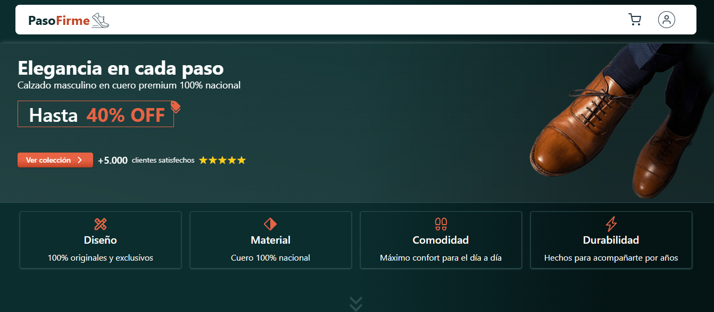
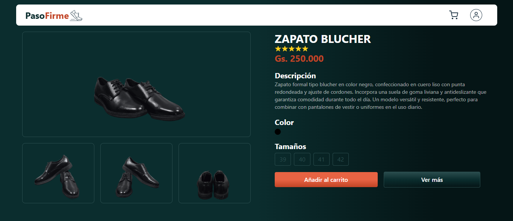
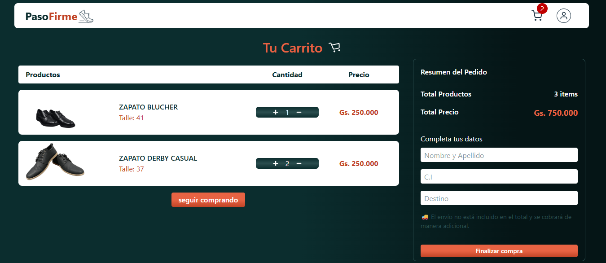
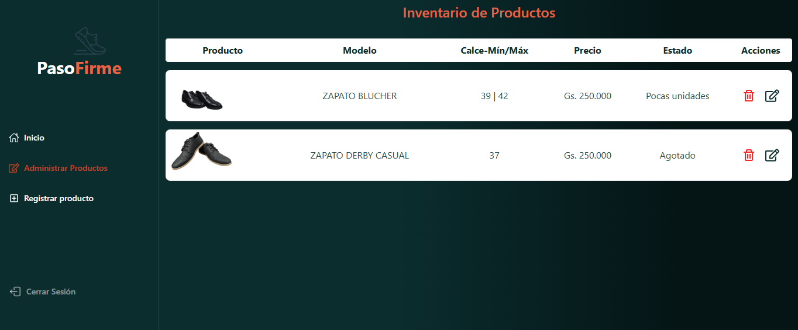
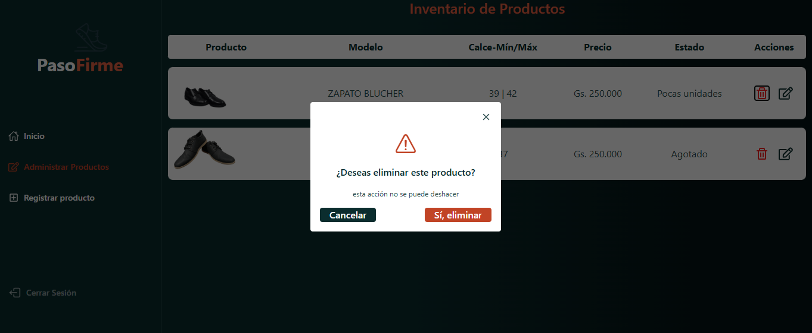
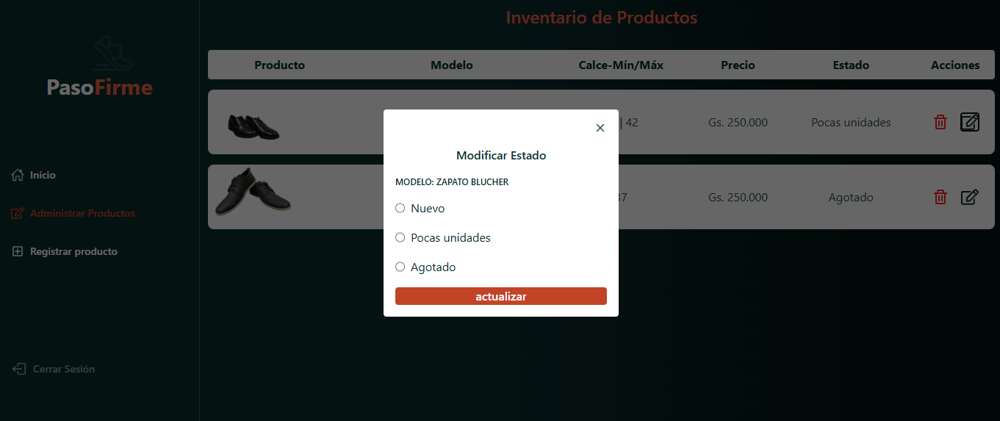
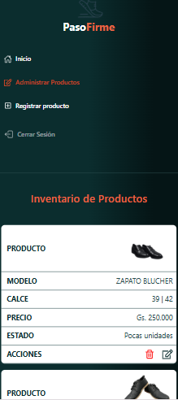
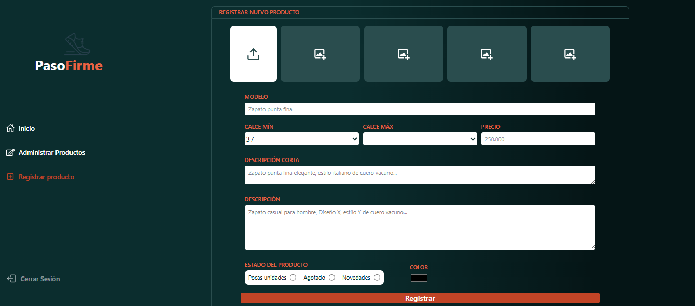
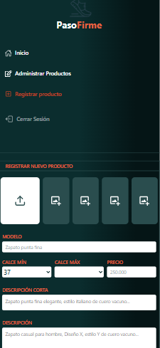

# 👟 PasoFirme


**PasoFirme** es una aplicación web de **ecommerce tipo catálogo** enfocada en la venta de zapatos.

El sistema permite visualizar productos, agregarlos al carrito y gestionar el catálogo mediante un **panel administrativo protegido**.

La aplicación está desarrollada con **React + TypeScript** y utiliza **Firebase como backend** (Authentication, Firestore y Storage).

---

# 🚀 Demo

*(Agregar cuando hagas deploy)*

Frontend: https://pasofirme.vercel.app

---

# 📸 Screenshots

### Página principal



### Detalle de producto



### Carrito



### Dashboard administrador






### New



---

# 🎯 Objetivo del proyecto

PasoFirme fue desarrollado como una solución real para gestionar un catálogo de calzados y permitir su visualización online.

El proyecto demuestra el uso de:

* Arquitectura basada en Context API
* Integración con Firebase
* Manejo de estado global
* Formularios con validación de esquemas
* Paginación y filtrado de datos en Firestore
* Panel administrativo protegido

---

# 🛠 Stack Tecnológico

## Frontend

* ⚛️ React
* ⚡ Vite
* 🟦 TypeScript
* 🎨 TailwindCSS
* 🎯 CSS Modules

## Backend (BaaS)

Firebase:

* 🔐 Firebase Authentication → autenticación de administradores
* 📦 Firestore → base de datos NoSQL
* 🖼 Firebase Storage → almacenamiento de imágenes

## Formularios y validación

* React Hook Form
* Zod
* @hookform/resolvers

## Gestión de estado

* React Context API

---

# 🏗 Arquitectura del sistema

El frontend está construido con React y consume servicios de Firebase como backend.

```
Usuario
   │
   ▼
React + Vite + TypeScript
   │
   ├── Context API
   │      ├── AuthContext
   │      ├── CartContext
   │      └── ProductsContext
   │
   ▼
Firebase
   ├── Authentication
   ├── Firestore Database
   └── Storage (imagenes de productos)
```

Flujo general:

1. El usuario navega por el catálogo.
2. Los productos se consultan desde **Firestore**.
3. Las imágenes se cargan desde **Firebase Storage**.
4. Los administradores se autentican con **Firebase Authentication**.
5. El estado global se gestiona con **React Context API**.

---

# 🧠 Gestión de estado global

La aplicación utiliza **Context API** para manejar estados globales importantes.

## AuthContext

Gestiona la autenticación del administrador usando Firebase.

Características:

* escucha cambios de sesión con `onAuthStateChanged`
* expone:

  * `signed`
  * `loadingAdmin`
  * `uid`

Esto permite proteger rutas administrativas.

---

## CartContext

Gestiona el carrito de compras del usuario.

Funciones principales:

* `addItemCart()` → agrega productos al carrito
* `removeItemCart()` → elimina productos
* cálculo automático del total
* manejo de cantidades por producto y talle

El total se calcula usando `reduce()` y se formatea en **moneda guaraní (PYG)**.

---

## ProductsContext

Gestiona el catálogo de productos y las consultas a Firestore.

Funciones principales:

### Carga inicial de productos

```
loadInitialProducts()
```

Consulta los productos ordenados por fecha de creación.

### Paginación

```
getProducts()
```

Carga más productos usando:

```
startAfter()
limit()
```

### Búsqueda

```
searchProducts()
```

Filtra productos por modelo utilizando un **range query** en Firestore.

### Actualización de producto

```
updateItem()
```

Permite cambiar el estado del producto desde el dashboard administrativo.

---

# 📂 Estructura del proyecto

```
src
│
├── components
│
├── contexts
│   ├── auth
│   │   ├── AuthProvider.tsx
│   │   └── authContext.ts
│   │
│   ├── cart
│   │   ├── CartProvider.tsx
│   │   └── CartContext.ts
│   │
│   └── products
│       ├── ProductsProvider.tsx
│       └── ProductsContext.ts
│
├── pages
│   ├── home
│   ├── detail
│   ├── carrito
│   ├── login
│   └── dashboard
│       └── new
│
├── routes
│   └── private.tsx
│
├── services
│   └── firebaseConnection.ts
│
├── styles
│   └── index.css
│
├── App.tsx
└── main.tsx
```

---

# 🔐 Rutas protegidas

El dashboard administrativo está protegido mediante una **ruta privada**:

```
routes/private.tsx
```

El componente verifica si el administrador está autenticado antes de permitir acceso.

---

# ⚙️ Instalación

Clonar el repositorio

```bash
git clone https://github.com/DPachinik/PasoFirme.git
```

Entrar al proyecto

```bash
cd PasoFirme
```

Instalar dependencias

```bash
npm install
```

Ejecutar en desarrollo

```bash
npm run dev
```

Servidor local

```
http://localhost:5173
```

---

# 🔧 Variables de entorno

Crear un archivo `.env`

```
VITE_FIREBASE_API_KEY=
VITE_FIREBASE_AUTH_DOMAIN=
VITE_FIREBASE_PROJECT_ID=
VITE_FIREBASE_STORAGE_BUCKET=
VITE_FIREBASE_MESSAGING_SENDER_ID=
VITE_FIREBASE_APP_ID=
```

---

# 📈 Mejoras futuras

* checkout completo
* integración con pagos
* persistencia del carrito
* filtros avanzados
* panel de pedidos
* optimización SEO

---

# 👨‍💻 Autor

**DavidPachinik**

Proyecto personal desarrollado como **aplicación real de ecommerce** para la gestión y venta de calzado online.
